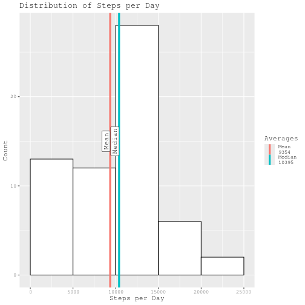
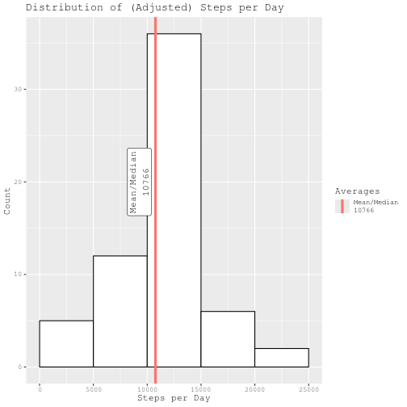
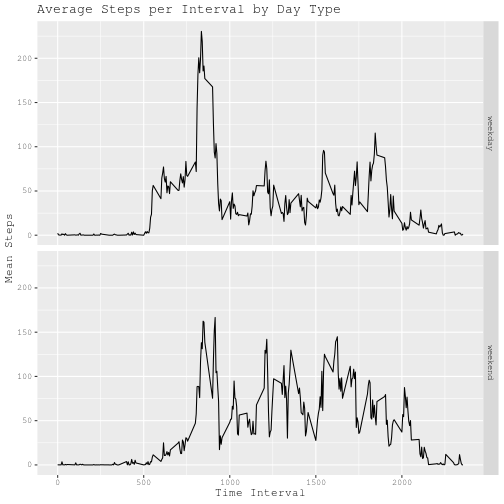

## Loading and preprocessing the data


``` r
library(readr)
library(dplyr)
library(tidyr)
library(knitr)
library(ggplot2)
library(purrr)

options(scipen = 999999999)
```


``` r
activity <- read_csv(
  "activity.zip",
  col_types = cols(
    steps = col_double(),
    date = col_date(format = ""),
    interval = col_double()
  )
)
length <- activity |> count() |> pull(n)
activity |> head() |> kable()
```


| steps|date       | interval|
|-----:|:----------|--------:|
|    NA|2012-10-01 |        0|
|    NA|2012-10-01 |        5|
|    NA|2012-10-01 |       10|
|    NA|2012-10-01 |       15|
|    NA|2012-10-01 |       20|
|    NA|2012-10-01 |       25|

* There are 17,568 records.
* Each record represents a count of steps taken in 5 min intervals.
* The data covers two months in 2012.
* There is a single anonymous subject.

## What is mean total number of steps taken per day?


``` r
steps_per_day <- activity |>
  group_by(date) |>
  summarise(
    totsteps = sum(steps, na.rm = TRUE)
  )

breaks <- pretty(
  range(steps_per_day$totsteps),
  n = nclass.Sturges(steps_per_day$totsteps),
  min.n = 1
)

summary <- tibble(
  average = c(
    round(mean(steps_per_day$totsteps)),
    round(median(steps_per_day$totsteps))
  ),
  label = c(
    "Mean",
    "Median"
  )
)

steps_per_day |>
  ggplot() +
  geom_histogram(
    aes(totsteps),
    breaks = breaks,
    color = 1,
    fill = "white"
  ) +
  geom_vline(
    data = summary,
    aes(
      xintercept = average,
      color = paste(label, average, sep = "\n")
    ),
    linewidth = 1.5
  ) +
  geom_label(
    data = summary,
    aes(
      average,
      15,
      label = label
    ),
    angle = 90,
    nudge_x = -500
  ) +
  labs(
    title = "Distribution of Steps per Day",
    x = "Steps per Day",
    y = "Count",
    colour = "Averages"
  )
```



## What is the average daily activity pattern?


``` r
usteps_per_interval <- activity |>
  group_by(interval) |>
  summarise(usteps = mean(steps, na.rm = TRUE))

usteps_per_interval |>
  ggplot(aes(interval, usteps)) +
  geom_line() +
  labs(
    title = "Average Steps per Day by Interval",
    x = "Time Interval",
    y = "Steps"
  )
```


``` r
highest_usteps <- usteps_per_interval |>
  arrange(desc(usteps)) |>
  pull(1) |>
  first()
```

* 8.35am has the highest average steps across days (206).

## Imputing missing values


``` r
missing <- activity |>
  pull(steps) |>
  is.na()
count_missing <- sum(missing)
proportion_missing <- mean(missing)
```

* There are 17,568 records.
* 2,304 are missing a steps value.
* This is 13% of the records.


``` r
adjusted_activity <- activity |>
  mutate(
    steps = coalesce(
      steps,
      rep_len(usteps_per_interval$usteps, length(steps))
    )
  )

adjusted_steps_per_day <- adjusted_activity |>
  group_by(date) |>
  summarise(totsteps = sum(steps))

adjusted_breaks <- pretty(
  range(adjusted_steps_per_day$totsteps),
  n = nclass.Sturges(adjusted_steps_per_day$totsteps),
  min.n = 1
)

adjusted_summary <- tibble(
  average = c(
    round(mean(adjusted_steps_per_day$totsteps))
  ),
  label = c(
    "Mean/Median"
  )
)

adjusted_steps_per_day |>
  ggplot() +
  geom_histogram(
    aes(totsteps),
    breaks = breaks,
    color = 1,
    fill = "white"
  ) +
  geom_vline(
    aes(
      xintercept = average,
      color = paste(label, average, sep = "\n")
    ),
    data = adjusted_summary,
    linewidth = 1.5
  ) +
  geom_label(
    data = adjusted_summary,
    aes(
      average,
      20,
      label = paste(label, average, sep = "\n")
    ),
    angle = 90,
    nudge_x = -1500
  ) +
  labs(
    title = "Distribution of (Adjusted) Steps per Day",
    x = "Steps per Day",
    y = "Count",
    colour = "Averages"
  )
```



* Missing step values for an interval have been replaced with the average for that interval over all days.
* This created an extra 86,130 steps over two months.
* This imputation changes the overall shape of the distribution. Most noticeably, the proportion of data below the average is increased. In other words, the adjusted distribution appears sedentary relative to the original.
* The mean and median are now the same value, suggesting imputation has corrected for skew in the original values.

## Are there differences in activity patterns between weekdays and weekends?


``` r
weekend_weekday <- adjusted_activity |>
  pull(date) |>
  weekdays() |>
  map_chr(\(day_of_week) {
    if (day_of_week == "Saturday" || day_of_week == "Sunday") {
      "weekend"
    } else {
      "weekday"
    }
  }) |>
  as.factor()

adjusted_activity$day_type <- weekend_weekday

daily_usteps_by_interval_daytype <- adjusted_activity |>
  group_by(interval, day_type) |>
  summarise(usteps = mean(steps))
```

```
## `summarise()` has grouped output by 'interval'. You can override using the `.groups` argument.
```

``` r
daily_usteps_by_interval_daytype |>
  ggplot(aes(interval, usteps)) +
  geom_line() +
  facet_grid(day_type ~ .) +
  labs(
    title = "Average Steps per Interval by Day Type",
    x = "Time Interval",
    y = "Mean Steps"
  )
```


